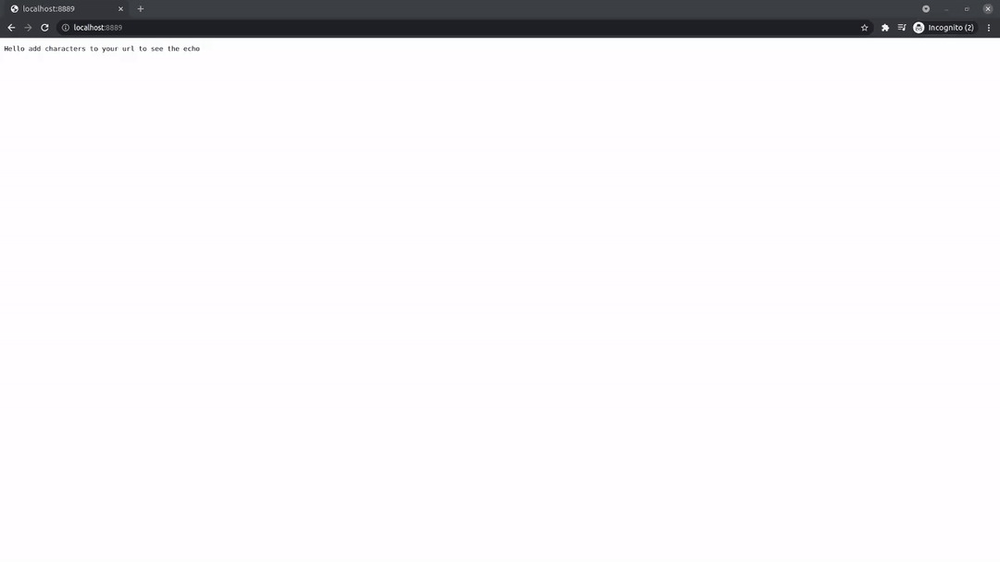

E3 epoll edge echo server
========================
E3 is an epoll edge-triggered server that echos the client request url

example:

    import e3

    def main():
    
        http_server = e3.server.Server()
        http_server.listen(8889)
        e3.loop.Loop.instance().start(http_server)
    
    if __name__ == "__main__":
        main()